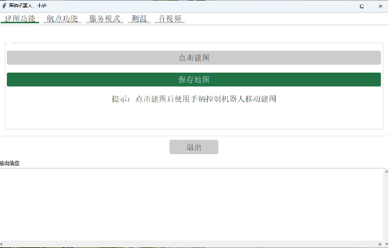

## 内容说明

设计了一款医护机器人，主要包含以下功能

|          |                                                              |
| -------- | ------------------------------------------------------------ |
| 业务需求 | 1. 四种主要功能：建图、标注航点、送药、音视频2. 机器人可以在这四种主要功能之间切换 |
| 数据需求 | 1. 地图的信息2. 航点的信息3. 体温的信息                      |
| 功能需求 | 1. 手动建图，保存地图2. 可以在图中标注相应的航点3. 可以到指定去药点取物并配送4. 可以与机器人进行音视频交互 |
| 异常处理 | 1) 检测到障碍物，尝试绕过障碍物，尝试失败则发出提示，超时未处理则返回出发点2) 当机械臂无法识别到目标物体时，停止当前的行为，并对用户发起异常指令3) 用户没有标注航点就开启导航服务的时候，请求用户标注航点4) 在对应界面，用户连续点击开始按钮或者结束按钮等，需要提示用户已经进行该操作，并且只向机器人发送一次请求 |

### 内容展示如下

展示视频链接：
链接: https://pan.baidu.com/s/1pSK5IDq4lDXQDZQMcrfMEw?pwd=crdk 提取码: crdk




## 如何运行

将team_3文件夹拷贝到机器人电脑的工作空间src文件夹下，除team_3文件外，还应具有下列官方包。

```
├── src                     # ROS包
│   ├── team_3              # 主要功能包
│   │   ├── config                  # 配置文件
│   │   ├── launch                  # launch文件
│   │   ├── maps                    # 保存的地图
│   │   ├── marks                   # 保存的航点
│   │   ├── scripts                 # python代码
│   │   ├── src                     # c代码
│   │   └── srv                     # 自定义服务类型
│   ├── rplidar_ros             # 激光雷达包（官方包）
│   ├── iai_kinect2             # 相机包（官方包）
│   ├── waterplus_map_tools     # 标注工具包（官方包）
│   ├── wpb_home                # 机器人功能包（官方包）
│   ├── wpr_simulation          # 模拟包（官方包）
│   └── xfyun_waterplus         # 语音包（官方包）
```

**运行：catkin_make**

机器人端，在scripts目录下执行：python3 controller.py

机器人端口与客户端据开启todesk远程连接

ROS包的安装

```shell
sudo apt-get install ros-melodic-joy
sudo apt-get install ros-melodic-hector-mapping
sudo apt-get install ros-melodic-gmapping
sudo apt-get install ros-melodic-map-server
sudo apt-get install ros-melodic-navigation
sudo apt-get install ros-melodic-move-base
sudo apt-get install ros-melodic-amcl
sudo apt-get install ros-melodic-cv-bridge
sudo apt-get install ros-melodic-audio-common
sudo apt-get install libasound2
sudo apt-get install ros-melodic-sound-play
```

## python包

通过apt安装以下包：

```shell
sudo apt install python3-tk
```

通过pip安装以下包

Pillow==9.5.0

psutil==5.9.4

PyYAML==6.0


